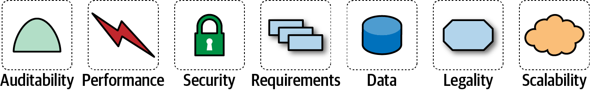

= Architecture Characteristics

*_"-ilities"_*

This is a better term for "non functional" requirements.

Domains is a better word for function requirements.

*Criteria for being a characteristic*:

* Not in domain
* Critical
* Structural

I think this dovetails into the design vs architecture discussion from before. A good key indicator should also be "how painful will this be to change later".

Love the attention given to configurability and calling it out as a thing that needs to be considered and planned on.

Nonrepudiation: can you prove it happened +
Accountability: can you show how did it

*Portability* has changed from meaning different hardware to different clouds

I'm enjoying the overlap/referencing of DDD. Each org/team/project having their own "ubiquitous" and defining it well is such a good way to avoid all the nonsense language in this industry.

