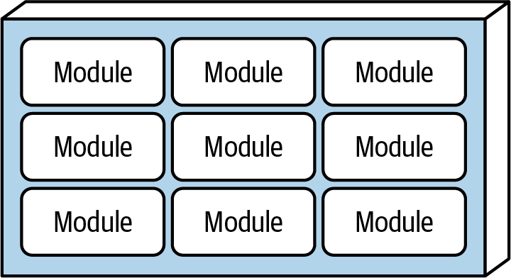

= The Modular Monolith Architecture Style

All functionality (aka all layers) for each domain in one module. 

Keep code reuse to a minimum

I don't understand how the mediator pattern doesn't result in cyclic dependencies

I like how this lends itself to fitness functions

Do domain teams really ever work?